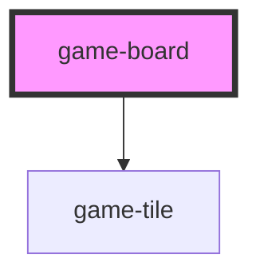

# game-board

<!-- Auto Generated Below -->

## Properties

| Property      | Attribute      | Description | Type                          | Default |
| ------------- | -------------- | ----------- | ----------------------------- | ------- |
| `cols`        | `cols`         |             | `number`                      | `8`     |
| `disabled`    | `disabled`     |             | `boolean`                     | `false` |
| `gridData`    | `grid-data`    |             | `BoardTileData[][] \| string` | `[]`    |
| `rows`        | `rows`         |             | `number`                      | `8`     |
| `selectedCol` | `selected-col` |             | `number`                      | `-1`    |
| `selectedRow` | `selected-row` |             | `number`                      | `-1`    |

## Events

| Event                | Description | Type                                                                                       |
| -------------------- | ----------- | ------------------------------------------------------------------------------------------ |
| `game-tile-selected` |             | `CustomEvent<{ row: number; col: number; }>`                                               |
| `tile-swapped`       |             | `CustomEvent<{ from: { row: number; col: number; }; to: { row: number; col: number; }; }>` |

## Dependencies

### Depends on

- [game-tile](../game-tile)

### Graph

----------------------------------------------

*Built with [StencilJS](https://stenciljs.com/)*
