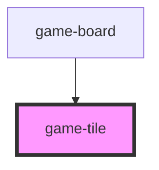

# game-tile

<!-- Auto Generated Below -->

## Properties

| Property   | Attribute  | Description | Type      | Default  |
| ---------- | ---------- | ----------- | --------- | -------- |
| `col`      | `col`      |             | `number`  | `0`      |
| `falling`  | `falling`  |             | `boolean` | `false`  |
| `matched`  | `matched`  |             | `boolean` | `false`  |
| `obstacle` | `obstacle` |             | `string`  | `'none'` |
| `row`      | `row`      |             | `number`  | `0`      |
| `selected` | `selected` |             | `boolean` | `false`  |
| `special`  | `special`  |             | `string`  | `'none'` |
| `type`     | `type`     |             | `string`  | `'ruby'` |

## Events

| Event                | Description | Type                                         |
| -------------------- | ----------- | -------------------------------------------- |
| `game-tile-selected` |             | `CustomEvent<{ row: number; col: number; }>` |

## Dependencies

### Used by

 - [game-board](../game-board)

### Graph

----------------------------------------------

*Built with [StencilJS](https://stenciljs.com/)*
